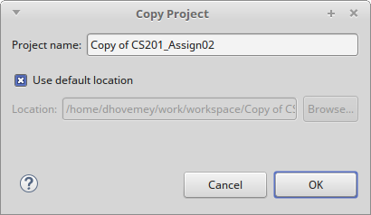
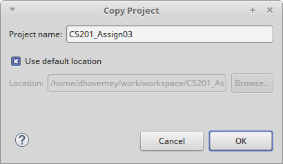
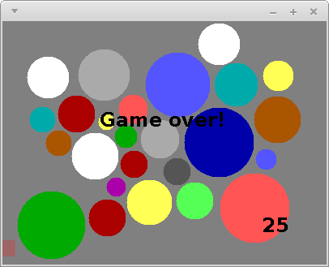
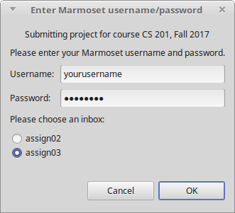

**Due**: Tuesday, June 18th by 11:59 PM

Acknowledgment: The idea for this assignment comes from [Tom Ellman](http://pages.vassar.edu/tomellman/) at Vassar College.

CS 201 - Assignment 3
=====================

Your Task
---------

Your task is to complete your implementation of the Disk Placement game described below.

You will use the **Disk** class you implemented in the previous assignment as an important building block in the completed game.

Getting Started
---------------

Start by making a copy of your **CS201\_Assign02** project (which you completed in the previous assignment.)

To make a copy of a project in Eclipse:

-   Right-click on the name of the project in the Package Explorer
-   Choose **Copy**
-   From the **Edit** menu, choose the **Paste** menu item

When you choose **Paste**, you will see a dialog box similar to the following one:

> 

Change the project name to **CS201\_Assign03**:

> 

Click **OK**.

Disk Placement Game
-------------------

In this assignment you will implement the "Disk Placement" game. Here is a screenshot of what the completed game will look like:

> 

The goal is to place disks of random sizes and colors onto the game board so that

1.  no disk overlaps any other disk, and
2.  every disk lies entirely within the rectangular game board

The solid disks are the ones that have been successfully placed. The black disk outline follows the mouse and shows where the next disk could be placed. The number in the lower right-hand corner shows the number of disks that have been successfully placed.  The pink bar at the bottom of the window is a bar showing how much time remains to place the current disk.

The game ends when a disk

* is placed in a position where it overlaps another disk,
* is not entirely placed within the game board, or
* is not placed before the countdown timer expires

When the game ends, a game over message should be displayed:

> 

You can download my implementation of the game to see how it works:

> [disks-obfuscated.jar](disks-obfuscated.jar)

On Windows systems, just double-click on the file. On Linux and MacOS, open a terminal window, change directory into the directory in which you saved the file, and run the command

    java -jar disks-obfuscated.jar

Specifications and Hints
------------------------

You will make all of your code changes to the **DisksPanel** class, which implements the game play.

You should add whatever fields are necessary to represent the state of the game. You will probably want to use an array of **Disk** elements to represent the disks that have been placed.

### Constructor

The constructor should initialize all of the fields of **DisksPanel**.  This could include:

* create a new random **Disk** object and store a reference to it in a field
* create an array of **Disk** references and store a reference to it in a field
* start the count of how many disks have been placed at 0
* initialize the initial timeout duration and the amonut of time remaining to place the current disk (these could be **int** fields)

### Mouse events

The **handleMouseMove** method is called whenever the mouse pointer is moved within the window. You can get the x and y coordinates as follows:


int x = e.getX();
int y = e.getY();


where **e** is the parameter to the method, an instance of the **MouseEvent** class. You will need state variables to keep track of the current location of the mouse pointer.

The **handleMouseClick** method is called whenever a mouse button is clicked. You should use this method to place a disk in the window. You will need to check to ensure that the placed disk

1.  does not overlap any previously placed disk, and
2.  is placed entirely within the bounds of the panel

The **WIDTH** and **HEIGHT** constants provide the width and height of the panel.

Remember that you will need to call **repaint** to force the contents of the panel to be redrawn when the game state changes.

### Disk creation

When the next disk is ready to be placed, its radius should be randomly chosen in the range 10..44, inclusive. You can generate random numbers using an instance of the **java.util.Random** class as a field:


private Random rand;


Create an instance in your constructor:


rand = new Random();


You can generate a random number uniformly chosen from the range 0..n-1, inclusive, using the method call


rand.nextInt(n)


### Disk placement

The game will need to keep track of each disk that has been placed successfully.  One approach is to use an array.  For example, add the following fields to the **DisksPanel** class:


private Disk[] disks;
private int diskCount;


In the constructor:


disks = new Disk[500];
diskCount = 0;


When a disk is placed successfully, a reference to the new **Disk** object should be added to the array.  The **diskCount** field can be used to keep track of how many disks have been placed.  Note that the **diskCount** field also indicates where in the array the next disk should be placed.

### Timer events

The skeleton code for the **DisksPanel** class creates an instance of the **javax.swing.Timer** class and stores it in a field called **timer**.  It also sets up an evvent handler which calls the **handleTimerEvent** method when the timer fires.  The timer is configured to fire after a delay of 0.1 seconds.  So, you can think of one timer "tick" as being one tenth of a second.

You should use an **int** field to keep track of how many ticks the player has left to place the current disk.  Each time a timer event occurs, you should decrement this field.  If the value of the field reaches 0, then the game is over because the timeout expired.

When the game starts (i.e., in the **DisksPanel** constructor), you should call **timer.start()** to start the timer running.  By default, timer events will be generated repeatedly, so you don't need to restart the timer when a timer event occurs.

When a disk is placed successfully, you can call **timer.stop()** followed by **timer.start()** to make sure that the user receives the full amount of time to place the next disk.  Also, you should reset the field that keeps track of how many ticks the user has remaining to place the next disk.

For extra credit, you can make the game more challenging by decreasing the number of ticks available each time the user places a disk successfully.

### The paint method

The **paint** method should use the fields representing the game state to render the current configuration.

Some **java.awt.Graphics** methods that will be useful:

-   **setColor** - Sets the drawing color.
-   **drawOval** - Draws an outlined oval. If the width and height are the same, draws an outlined circle.
-   **fillOval** - Draws a filled oval. If the width and height are the same, draws a filled circle.
-   **setFont** - Sets the current font used for drawing text.
-   **drawString** - Draws a string of text characters.

The **paint** method should draw a circle (using the appropriate color) for each disk.  If you used the approach suggested above, the **disks** array will contain references to all of the placed **Disk** objects, and the **diskCount** field will record how many there are.

Note that because the **Disk** class uses **double** values to represent coordinates and dimensions, but the methods of **java.awt.Graphics** require **int** values, you will need to use type casts to convert from **double** values to **int** values.  For example, let's say that **x**, **y**, **w**, and **h** are the coordinates and width/height of a circle you want to draw.  The call to **fillOval** would be


g.fillOval((int) x, (int) y, (int) w, (int) h);


Also note that the x/y coordinates of a disk represent its center, but the x/y coordinates in a call to **fillOval** are the upper left corner of a rectangle surrounding the oval being drawn.  You will need to adjust the coordinates accordingly when drawing a disk.

You should draw the bar indicating how much time the user has left to place the next disk using a partially transparent color.  Colors can have an "alpha channel", which is a value between 0 and 255, where 255 is completely opaque and 0 is completely transparent.  In our solution, we used


Color barColor = new Color(255, 23, 23, 63);


as the bar color.

Running the program
-------------------

To run the program, right-click on **DisksApp.java** and choose **Run as&rarr;Java Application**.

An Agile Approach to Developing the Disk Game Assignment
--------------------------------------------------------

The code for this assignment, as provided, compiles and runs.  It doesn't do much - it only paints a grey board and it doesn't process any events - but it does run.  Let's take an agile programming approach to building this assignment.

One of the tenets of agile programming is to always have something running and then make small incremental changes, while maintaining a running application.  So, let's build this program in small steps, so that the code is always working - and each step adds a little bit more of the required functionality.

But first, you need to have a fundamental understanding of the problem - at a high level.  Can you describe what it is you are being asked to do - in your own words - without looking at the problem description?  Essentially, you need to first study the problem description, roll it the problem around in your head, and draw it on paper or on a white board, before trying to code it.  If you can't describe the problem to your friends, your family, or your classmates, then you don't have a fundamental understanding of the problem.

Here is what a description of the problem might look like:

: Create a game where colored disks of random sizes are placed on a board.  The game continues as long as the newly placed disk does not overlap with any of the other disks, and the new disk is completely inside the boundaries of the board, and the time allowed to place the disk has not run out.

And here are the details:

* As the mouse moves, display a black circle centered around the cursor.

* When the user clicks the mouse, if the circle overlaps any existing disks or is out-of-bounds, the game is over.  If not, place a disk of the same size as the circle centered on the location of the mouse click.  Give the disk a color from the DiskColor pallette.

* Generate a new circle of a random size, and repeat the above.

* Display the count of disks placed.

* Run a timer to limit how long the user has to place a disk. If the timer times out before the new disk is placed, the game is over.  Otherwise, restart the timer each time a disk is placed.

* Display a timer bar indicating how much time is left to place a disk.

* When the game is over, display "Game Over".

How should we approach implementing this program, with all of its details?  Here is a suggested order for implementation of the required features:

1. Just paint a black circle centered around the mouse - a fixed size circle - don't worry about the details yet.  Verify that the mouse is centered inside the circle, and that the circle follows the mouse.  Don't move on to the next step until this step performs correctly.

1. Next, for a mouse click, just place a single disk on the board, with the current size of the circle, and with a fixed color.  Don't worry about saving it in the disk array, or random size, or color, or any of the other details - just keep track of a single disk, and paint it to the board.

1. Now add the Disk array, and save each Disk in the array as the mouse is clicked.  Again, don't worry about any other details, like random size, color, out-of-bounds, or overlap.

1. Now paint the DiskArray to the board, using the Disk information as it is stored for each Disk in the Disk array.  Note that all of the Disks will have the same size and color at this time.

1. Add in the RANDOM radius - when the mouse is clicked, create the new circle with a RANDOM radius (10 to 44) that follows the mouse.  Make sure that when each Disk is saved to the Disk array, it has the same radius as the circle did.

1. Now generate colors for the Disks.  These could be random, or follow a specific order through the DiskColor array.  The following code may look somewhat strange, but it returns the ith color directly from the DiskColor enum: 
    
        DiskColor newDiskColor = DiskColor.values()[i];
                
1. Add displaying the count of the Disks.

1. Now add the out-of-bounds test.  Where should that code be placed - before or after you put the Disk in the Disk array?  Make sure to end the game when an out-of-bounds condition occurs.

1. Now add the overlaps test.  Remember to check the disk being placed against all of the Disks in the Disk array so far.  Where does the code for that test go - before or after you put the Disk in the Disk array?  Make sure to end the game when an overlap is detected.

1. Display "Game Over" when the game has ended.  The game should no longer respond to events.

1. Display the Timer bar.  Don't run the timer yet, just display the bar.

1. Stop and restart the timer on each mouse click.  Don't worry about keeping track of time, yet.

1. To keep track of time, count the number of timer events.  Timer events occur 0.1 seconds (100 ms) apart.

1. Reset the timer count each time a mouse click occurs.

1. Update the length of the timer bar to be proportional to the amout of time left before the timer runs out.

1. End the game when the timer reaches the time out value.    

The basic strategy is to work on one task at a time, and get that task working, before moving on to the next task.  Always get your code running correctly for the current task, first.

Attack the major tasks first: circle follows mouse, paint a Disk where the circle was when the mouse was clicked, keep track of all Disks in the Disk array, etc...  First discover how each part works, and then add in the details.  Concentrate on one task at a time - small changes with frequent builds.

Make changes in the code to as few places as possible at any one time - compile and run often - see that your changes work.  Tweak them as necessary until they do.

Add fields as they become necessary - a reference to a disk you are currently placing, the Disk count, an array to hold the placed Disks, a timer count, an indication that the game is over.

One other important step - save your work frequently.  As you get each important piece working, archive your project so that you can return to a previous working state if you irreversibly break your code while adding in the next component.  You can repeatedly archive your project using different archive file names.

Grading
-------

The grading will be done as follows:

-   Displaying the outline of the next disk to be placed - 10%
-   Allowing disks to be placed, drawing them - 20%
-   Detecting overlap and out-of-bounds - 15%
-   Keeping track of time remaining to place disk - 10%
-   Displaying bar to indicate remaining time - 10%
-   Keeping score, displaying score - 15%
-   Detecting end of game, displaying "Game over" - 20%

Extra credit options:

-   Growing the disks array as needed, rather than preallocating a large array - up to 5%
-   Decreasing the timeout each time a disk is placed successfully - up to 10%

Also note that points may be deducted for poor coding style.

Submitting
----------

When you are done, submit the assignment to the Marmoset server using one of the methods below.

You need to submit the entire project.  Submitting a single source
file is not sufficient.  Failure to follow the submission instructions
could result in a lower grade on the assignment.

### From Eclipse

If you have the [Simple Marmoset Uploader Plugin](../resources.html) installed, select the project (**CS201\_Assign03**) in the package explorer and then click the blue up arrow button in the toolbar. Enter your Marmoset username and password when prompted.  Make sure your choose **assign03** as the inbox:

> 

This is the recommended way to submit your work.

### From a web browser

Save the project (**CS201\_Assign03**) to a zip file by right-clicking it and choosing

> **Export...&rarr;Archive File**

Upload the saved zip file to the Marmoset server as **assign03**. The server URL is

> <https://cs.ycp.edu/marmoset/>

Use this method only if there is some reason why you can't use the plugin.

### After you submit

**Very important**: After you submit the assignment, please log into the Marmoset server (<https://cs.ycp.edu/marmoset>) and check the files you submitted to make sure that they are correct.

*It is your responsibility to make sure that you have submitted your work correctly.*
