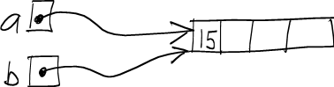
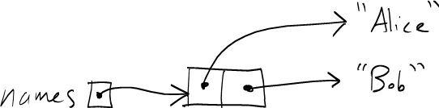

Note: see the [course notes on arrays](../notes/javaArrays.html) for more detailed information about arrays in Java.

JUnit
=====

Classes are the "parts" of an object-oriented program.

Testing makes sure that the parts work correctly.

If the individual classes don't work correctly, the overall program is probably not going to work correctly. Therefore, it is very important to have a good set of tests for the classes in your program.

[JUnit](http://junit.org/) is a *unit testing* framework for Java programs. To use JUnit, you write *test classes*. A test class is designed to test one Java class. It contains one or more *test methods*. Each test method is designed to test one particular feature of the class being tested.

General structure of a JUnit test class
=======================================

The test class's fields (member variables) store references to objects (generally, instances of the class being tested). These fields and the objects they point to are called the *test fixture*.

A test class's **setUp** method creates the test fixture objects. This method is called automatically before each test method is called. It must be marked with the **@Before** annotation.

The test methods call methods on the test fixture objects and check to see that the methods compute the correct result, typically by calling an *assertion method*. Assertion methods are methods defined by the JUnit framework specifically for checking that calls to methods in classes being tested compute the expected result. Each test method must be marked with the **@Test** annotation.

Ideally, a test method should focus on one particular method to be tested.

Kinds of JUnit assertion methods:


assertEquals(expected, actual); // assert that two values (expected and actual) are equal to each other

assertTrue(value); // assert that a boolean value is true

assertFalse(value); // assert that a boolean value is false


Most assertions in JUnit test classes will boil down to checking that the return value of a method call is equal to an expected value.

If an assertion is not satisifed, it causes the test method containing the assertion to fail. If all assertions in a test method are satisifed, the test method containing the assertion passes. The goal of testing using JUnit is that all assertions in all test methods should pass.

Eclipse has built-in support for running JUnit tests. To run a JUnit test class within eclipse, right-click on the test class, and choose **Run As...&rarr;JUnit test**. The result will be displayed in the JUnit window:

-   Green bar: all of the test methods passed
-   Red bar: at least one of the test methods failed

JUnit Example
=============

As an example, let's consider an improved version of our **Point** class:


public class Point {
  private int x;
  private int y;

  public Point(int x, int y) {
    this.x = x;
    this.y = y;
  }

  public int getX() {
    return x;
  }

  public int getY() {
    return y;
  }

  public void setX(int x) {
    this.x = x;
  }

  public void setY(int y) {
    this.y = y;
  }

  public void print() {
    System.out.println("x=" + x + ", y=" + y);
  }
}


Here's a very simple JUnit class for testing the **Point** class. We'll call the test class **PointTest**.


import static junit.framework.Assert.*;
import org.junit.Before;
import org.junit.Test;

public class PointTest {
  private Point p;
  private Point q;

  @Before
  public void setUp() throws Exception {
    p = new Point(4, 5);
    q = new Point(13, 14);
  }

  @Test
  public void testGetX() throws Exception {
    assertEquals(4, p.getX());
    assertEquals(13, q.getX());
  }

  @Test
  public void testGetY() throws Exception {
    assertEquals(5, p.getY());
    assertEquals(14, q.getY());
  }

  @Test
  public void testSetX() throws Exception {
    p.setX(55);
    assertEquals(55, p.getX());

    q.setX(101);
    assertEquals(101, q.getX());
  }

  @Test
  public void testSetY() throws Exception {
    p.setY(1331);
    assertEquals(1331, p.getY());

    q.setY(90125);
    assertEquals(90125, q.getY());
  }
}


This is a very simple example, but it demonstrates the basic idea: for each method in the **Point** class, we want to have one or more test methods which check whether or not the method behaves correctly using some test input.

Note that there is one method in **Point** that we didn't test - the **print** method. It is actually quite difficult to test methods that write output to **System.out**.

Java Arrays
===========

Java arrays are a lot like C/C++ arrays.

The main difference is that Java arrays are *objects*, in the same way that instances of classes are objects. As with all objects in Java, instances of array are accessed through references. Thus, an array variable in Java is *not* the actual array: it is just a memory location in which a reference to an array may be stored.

Consider the following code:


int[] heaps;                 // (1)
heaps = new int[6];          // (2)


Line (1) creates a variable called **heaps** whose type is **int[]**, meaning "array of int". Because array variables store a reference to an array, and not the array itself, the variable does not point to any actual array yet.

Line (2) creates an array object for storing 6 **int** elements, and assigns the reference to the newly-created array to the variable **heaps**. Here's a picture:

> 

Like arrays in C and C++, Java arrays are indexed starting at 0. So, the valid range of indices for this array is 0..5.

Because arrays are accessed through references, it is possible to have two array variables storing references to the same array object. For example:


int[] a;
int[] b;

a = new int[4];
b = a;

a[0] = 15;

// (1)

System.out.println(b[0]); // prints 15

a[0] = 16;

// (2)

System.out.println(b[0]); // prints 16


As a picture, here's what's happening at point (1):

> 

Here's what's happening at point (2):

> 

Array length
============

One nice feature of Java that is not present in C and C++ is the ability to determine the exact number of elements in an array. If *arr* is an array, then


arr.length


is the number of elements in the array.

For example, the following static method will compute the sum of the elements of any array of **int** values:


public static int sum(int[] arr) {
  int sum = 0;

  for (i = 0; i < arr.length; i++) {
    sum += arr[i];
  }

  return sum;
}


Default values
==============

When an array object is created using the **new** operator, each element of the array is automatically initialized with a *default value*. The default value is 0 for all numeric element types, and the special *null* reference for all class and array element types.

Here's a code snippet that illustrates the default value for an array of **int** values:


int[] t = new int[4];
System.out.println(t[0]);  // guaranteed to print 0


Arrays of references
====================

When an array has a class or array type as its element type, it stores references. In this way, array elements are the same as any other kind of variable.

For example:


String[] names = new String[2];
names[0] = "Alice";
names[1] = "Bob";

// (1)

for (int i = 0; i < names.length; i++) {
  System.out.println(names[i]);
}


Here's what things look like at point (1):

> 

Summary
=======

-   JUnit allows you to test a class by using *assertions* to check that calling methods on objects belonging to that class work correctly
-   Java arrays are really *objects* that are accessed by references, just like objects that are instances of a class
-   The **length** property of an array indicates how many elements an array object has
-   A multidimensional array in Java is really an array of references to arrays
-   Array elements are automatically initialized to a *default value*, which is 0 for numeric types and **null** for reference types (classes and arrays)
